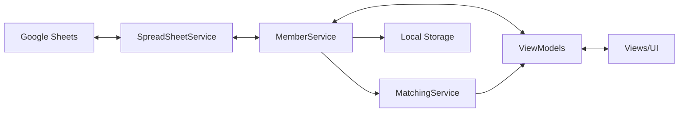

# 🎮 GameMatchingBom - Architecture Documentation

## 📋 목차
1. [프로젝트 개요](#프로젝트-개요)
2. [아키텍처 설계](#아키텍처-설계)
3. [핵심 컴포넌트](#핵심-컴포넌트)
4. [데이터 흐름](#데이터-흐름)
5. [주요 기능 구현](#주요-기능-구현)
6. [개발 가이드](#개발-가이드)
7. [향후 개선 방향](#향후-개선-방향)

---

## 프로젝트 개요

### 🎯 목적
**GameMatchingBom**은 리그 오브 레전드 커스텀 게임을 위한 팀 매칭 도구입니다. 플레이어들의 실력을 기반으로 균형 잡힌 팀을 자동으로 구성하고, 게임 기록을 관리하며, 랭킹 시스템을 제공합니다.

### 🔑 주요 기능
- **스마트 팀 매칭**: 티어 기반 자동 밸런싱 알고리즘
- **멤버 관리**: Google Sheets 연동을 통한 플레이어 데이터 관리
- **플레이 기록**: 게임 결과 추적 및 포인트 시스템
- **챔피언 선택**: 리그 오브 레전드 챔피언 드래프트 시뮬레이션
- **랭킹 시스템**: 참여도 및 성과 기반 순위표

### 🛠 기술 스택
```
- Framework: WPF (.NET)
- Architecture: MVVM Pattern
- UI Library: HandyControl
- DI Container: Microsoft.Extensions.DependencyInjection
- Data Storage: Local File System + Google Sheets API
- Language: C# 
```

---

## 아키텍처 설계

### 🏗 전체 구조
```
┌─────────────────────────────────────────────────────────┐
│                      Presentation Layer                  │
│  ┌──────────────────────────────────────────────────┐  │
│  │                    Views (XAML)                   │  │
│  │  MainWindow / Home / MatchingResult / Peerless   │  │
│  └──────────────────────────────────────────────────┘  │
│  ┌──────────────────────────────────────────────────┐  │
│  │                   ViewModels                      │  │
│  │  MVVM Binding / Commands / State Management      │  │
│  └──────────────────────────────────────────────────┘  │
└─────────────────────────────────────────────────────────┘
                              ↕
┌─────────────────────────────────────────────────────────┐
│                     Business Layer                       │
│  ┌──────────────────────────────────────────────────┐  │
│  │                    Services                       │  │
│  │  Matching / Member / Champion / Navigation       │  │
│  └──────────────────────────────────────────────────┘  │
└─────────────────────────────────────────────────────────┘
                              ↕
┌─────────────────────────────────────────────────────────┐
│                       Data Layer                         │
│  ┌──────────────────────────────────────────────────┐  │
│  │                     Models                        │  │
│  │    User / Team / Match / ChampionInfo            │  │
│  └──────────────────────────────────────────────────┘  │
│  ┌──────────────────────────────────────────────────┐  │
│  │               External Data Sources               │  │
│  │          Google Sheets / Local Files             │  │
│  └──────────────────────────────────────────────────┘  │
└─────────────────────────────────────────────────────────┘
```

### 🎨 MVVM 패턴 구현

#### ViewModelBase
```csharp
public abstract class ViewModelBase : INotifyPropertyChanged
{
    // PropertyChanged 이벤트 구현
    // 모든 ViewModel의 기본 클래스
}
```

#### 의존성 주입 구조
```csharp
ServiceCollection services = new ServiceCollection();
services.AddSingleton<INavigationService, NavigationService>();
services.AddSingleton<IMemberService, MemberService>();
services.AddSingleton<IMatchingService, MatchingService>();
services.AddSingleton<IChampionService, ChampionService>();
services.AddTransient<MainWindowViewModel>();
// ... 기타 ViewModel 등록
```

---

## 핵심 컴포넌트

### 📦 Models

#### User 모델
```csharp
public class User
{
    public string Name { get; set; }        // 플레이어 이름
    public int Level { get; set; }          // 실력 레벨 (1-9)
    public Position Position { get; set; }  // 선호 포지션
    public bool Joined { get; set; }        // 참가 여부
}
```

#### Team 구조
```csharp
public class Team
{
    public ObservableCollection<User> Members { get; set; }
    public int TeamNumber { get; set; }
    public double AverageLevel { get; }  // 팀 평균 레벨
}
```

### 🔧 Services

#### IMatchingService - 팀 매칭 알고리즘
```csharp
public interface IMatchingService
{
    Match CreateMatch(IEnumerable<User> users, int teamCount);
    void BalanceTeams(Match match);
    void ShuffleWithFisherYates(List<User> users);
}
```

**핵심 알고리즘**:
1. **티어별 그룹화**: 플레이어를 레벨별로 분류
2. **균등 분배**: 각 티어에서 팀별로 균등하게 배분
3. **Fisher-Yates 셔플**: 무작위성 보장
4. **오버플로우 처리**: 균등 분배 불가능한 인원 처리

#### IMemberService - 멤버 데이터 관리
```csharp
public interface IMemberService
{
    ObservableCollection<User> Members { get; }
    Task LoadMembersFromGoogleSheets();
    void SaveMembersToLocal();
    void UpdatePlayRecord(User user, int points);
}
```

**주요 기능**:
- Google Sheets API 연동
- 로컬 캐싱 (오프라인 지원)
- 플레이 기록 추적
- 랭킹 계산

#### IChampionService - 챔피언 관리
```csharp
public interface IChampionService
{
    ObservableCollection<ChampionInfo> AvailableChampions { get; }
    ChampionInfo GetRandomChampion();
    void MarkChampionAsUsed(ChampionInfo champion);
    void ResetChampionPool();
}
```

### 🖼 ViewModels

#### HomeViewModel - 메인 화면
- 멤버 목록 표시/검색
- 참가자 선택
- 매칭 시작

#### MatchingResultViewModel - 결과 화면  
- 팀 구성 표시
- 결과 내보내기
- 재매칭 기능

#### UpdateRecordViewModel - 기록 관리
- 게임 결과 입력
- 포인트 계산 (내전: 3점, 자랭/칼바람: 1점)
- 랭킹 업데이트

---

## 데이터 흐름

### 🔄 전체 데이터 플로우


### 📊 상태 관리
1. **데이터 소스**: Google Sheets (Primary) / Local Files (Cache)
2. **서비스 레이어**: 비즈니스 로직 처리 및 데이터 변환
3. **ViewModel**: UI 상태 관리 및 명령 처리
4. **View**: 데이터 바인딩을 통한 자동 UI 업데이트

### 🔔 이벤트 전파
- `INotifyPropertyChanged`: 속성 변경 알림
- `ObservableCollection`: 컬렉션 변경 자동 감지
- `RelayCommand`: UI 명령 처리

---

## 주요 기능 구현

### ⚖️ 팀 밸런싱 알고리즘

```csharp
// 의사 코드
public Match CreateBalancedMatch(List<User> players, int teamCount)
{
    // 1. 티어별 그룹화
    var tierGroups = players.GroupBy(p => p.Level);
    
    // 2. 각 티어에서 균등 분배
    foreach (var tierGroup in tierGroups)
    {
        var shuffled = FisherYatesShuffle(tierGroup.ToList());
        DistributeEvenly(shuffled, teams);
    }
    
    // 3. 오버플로우 처리
    HandleOverflowPlayers(overflowPlayers, teams);
    
    return new Match { Teams = teams };
}
```

### 📈 랭킹 시스템

**포인트 체계**:
- 내전: 3점
- 자랭: 1점  
- 칼바람: 1점

**랭킹 계산**:
```csharp
public class PlayRecord
{
    public int TotalGames { get; set; }      // 총 게임 수
    public int TotalPoints { get; set; }     // 총 포인트
    public double AveragePoints => TotalPoints / (double)TotalGames;
    public int Ranking { get; set; }         // 전체 순위
}
```

### 🎲 챔피언 선택 시스템

1. **챔피언 풀 초기화**: 전체 챔피언 목록 로드
2. **랜덤 선택**: 사용 가능한 챔피언 중 무작위 선택
3. **중복 방지**: 선택된 챔피언 제외
4. **리셋 기능**: 새 게임 시작 시 풀 초기화

---

## 개발 가이드

### 🚀 시작하기

#### 필수 요구사항
- Visual Studio 2019 이상
- .NET Framework 4.7.2 이상 또는 .NET 6.0+
- Google Sheets API 키 (선택사항)

#### 프로젝트 설정
```bash
# 리포지토리 클론
git clone https://github.com/SeungmoHan/GameMatchingBom.git

# NuGet 패키지 복원
dotnet restore

# 빌드
dotnet build

# 실행
dotnet run
```

### 📝 코드 컨벤션

#### 네이밍 규칙
- **클래스/인터페이스**: PascalCase
- **메서드**: PascalCase
- **변수/파라미터**: camelCase
- **상수**: UPPER_SNAKE_CASE
- **Private 필드**: _camelCase

#### MVVM 규칙
1. **View 코드비하인드 최소화**: 로직은 ViewModel에 구현
2. **데이터 바인딩 활용**: 직접 참조 대신 바인딩 사용
3. **Command 패턴**: 모든 UI 액션은 Command로 처리
4. **서비스 분리**: 비즈니스 로직은 Service 레이어에 구현

### 🧪 테스트 가이드

#### 단위 테스트 작성
```csharp
[Test]
public void CreateMatch_ShouldBalanceTeamsEvenly()
{
    // Arrange
    var users = CreateTestUsers(10);
    var matchingService = new MatchingService();
    
    // Act
    var match = matchingService.CreateMatch(users, 2);
    
    // Assert
    Assert.AreEqual(2, match.Teams.Count);
    Assert.AreEqual(5, match.Teams[0].Members.Count);
    AssertTeamsAreBalanced(match.Teams);
}
```

### 🔧 확장 포인트

#### 새로운 Service 추가
1. `Services` 폴더에 인터페이스 정의
2. 구현 클래스 작성
3. `App.xaml.cs`의 DI 컨테이너에 등록
4. ViewModel에서 생성자 주입으로 사용

#### 새로운 View 추가
1. `Views` 폴더에 UserControl 생성
2. 대응하는 ViewModel을 `ViewModels` 폴더에 생성
3. `MainWindowViewModel`의 네비게이션에 추가
4. DataTemplate 매핑 설정

---

## 향후 개선 방향
**Last Updated**: 2025-08-19
